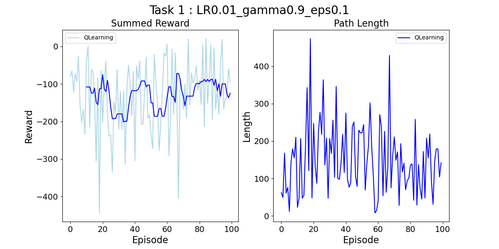
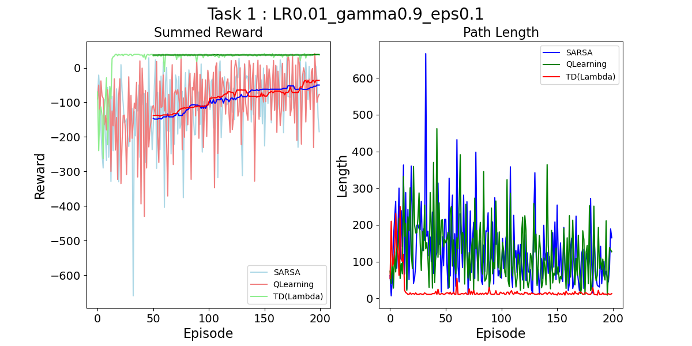
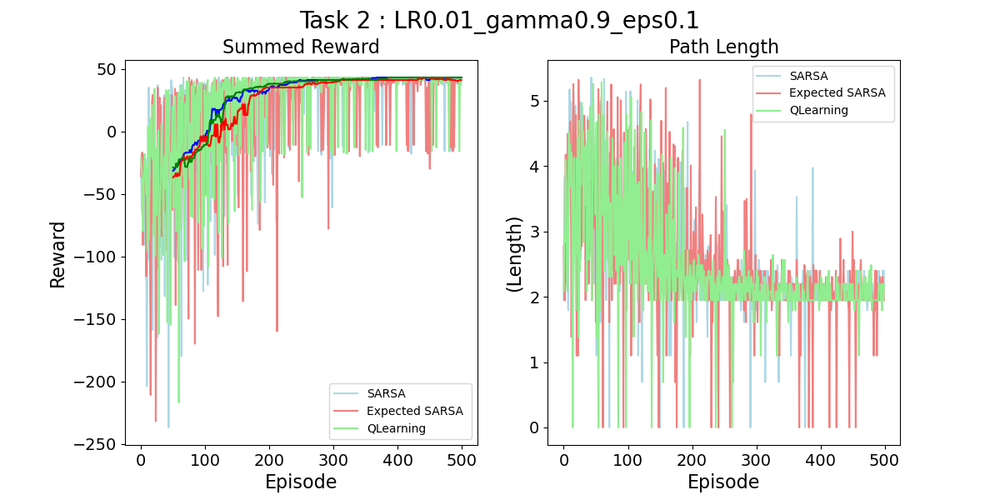
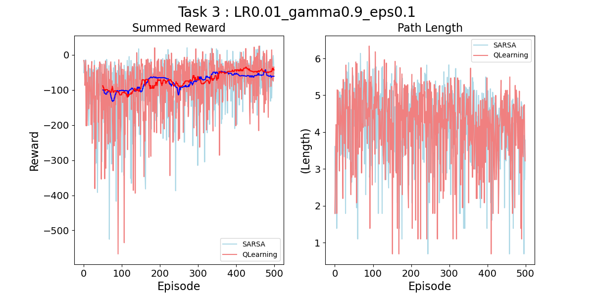

# Maze World - Assignment 2 - Part 2 (DRAFT)
Assignment code for course ECE 457C at the University of Waterloo in Spring 2025.

**Due Date:** *Friday, June 22, 2025 by 11:59pm* submitted as a PDF report submitted to Crowdmark (link will be emailed) and code submitted to the LEARN dropbox for your group.

**Collaboration:** You can discuss solutions and help to work out the code. But the work of the assignemnt must be done either *alone* or in a group of just *two people*. All code and writing will be cross-checked against each other and against internet databases for cheating. Some components of the solution will be graded automatically, so make sure to adhere to the given API. If you are doing the assignment alone, you still need to join a group on LEARN in order to get a dropbox. If you are working with a partner then you need to sign up for a group on LEARN and Crowdmark to link your submissions.

Updates to code which will be useful for all or bugs in the provided code will be updated on gitlab and announced.

## Domain Description - GridWorld
The domain consists of a 10x10 grid of cells. The agent being controlled is represented as a red square. The goal is a yellow oval and you receive a reward of 50 for reaching it, this ends and resets the episode.
Blue squares are **pits** which yield a penalty of -10 and end the episode. 
Black squares are **walls** which cannot be passed through. If the agent tries to walk into a wall they will remain in their current position and receive a penalty of -3. Apart from these, the agent will receive a -1 for reaching any other cell in the grid since the objective is to move to the goal state as quickly as possible.
There are **three tasks** defined in `run_main.py` which can be commented out to try each. They include a combination of pillars, rooms, pits and obstacles. The aim is to learn a policy that maximizes expected reward and reaches the goal as quickly as possible. You can set the taskNum variable for each task to change which one is beined learned.

  

### First Demo Experiment 

Each combination of RL Algorithm and environment parameters constitutes an experiment that we will run for a number episodes, restarting the environment again each episode but keeping the value function learned so far. You can add a new entry for each experiment in the experiments list and then they will all plot side-by-side at the end.


## Assignment Tasks

This assignment will have a written component and a programming component.
Clone the mazeworld environment locally and run the code looking at the implementation of the sample algorithm. For each of the following four algorithms you will implement them using the corresponding skeleton code, and provide a brief report on the algorithm definition and implementation considerations. 

### Part 1: Theory
Part 1 of the assignment is a theory question available on LEARN under Assignment 2.

### Part 2: Implement Some Core TD Methods

For each of the four algorithms there will be (**8%**) grading component for correct implementation. There are multiple ways to do this, but the approach should be runnable, and not be unnecessarily inefficient or difficult to follow.

**Code: (~8% each)**

1. Monte-Carlo - Implement the standard Monte-Carlo RL algorithm discussed in class. 
2. SARSA - Implement SARSA (`RL_brainsample_sarsa.py`) correctly
3. QLearning - Implement QLearning (`RL_brainsample_qlearning.py`) correctly
4. Expected SARSA - Implement Expected SARSA (`RL_brainsample_expsarsa.py`) correctly
   - (optional) Double QLearning - Implement Double QLearning (`RL_brainsample_doubqlearning.py`) correctly
5. TD($\lambda$) - Implement TD learning using eligibility traces (`RL_brainsample_EligTrace.py`).

`NOTE:` See the *Code Suggestions* section below for other information about the codebase and ideas for what to change. 

**Report:**

- **Algorithm (6% each):** Definition of algorithm mathematically, design of code additions, discussion of implementation issues and choices.
- **Results Analysis (20% total):** Analysis of results of all the algorithms in terms of performance time, quality, etc. You can start with the plots we have provided, but you can add other analysis. You should look at quality as well as computation time for the training stage and the testing stage.

## Evaluation

| Asg2              | Code Correctness | Report: Definition / Design | Report: Results Analysis |          |
| :---------------- | :--------------: | :-------------------------: | :----------------------: | :------: |
| Part 1 : Theory   |                  |             10%             |                          |          |
| Monte-Carlo             |  8%        |             6%              |          comparative                |          |
| SARSA             |        8%        |             6%              |          comparative                |          |
| Q-Learning        |        8%        |             6%              |          comparative                |          |
| Expected SARSA    |        8%        |             6%              |          comparative                |          |
| TD($\lambda$) |            8%       |              6%              |          comparative                |          |
| **Totals**        |     **40%**      |           **30%**           |         **20%**          | **100%** |


### Report Details

The report should be submitted on Crowdmark: 
- Describing each algorithm you used, define the states, actions, dynamics. Define the mathematical formulation of your algorithm, show the Bellman updates you use (use mathematical notation typed up in some form such as LaTex or MathTex). If there is some additional functions you needed to add, explain them briefly in the report. If you made any adjustments to the representation of states or actions for you local code, explain what you did.
- Some quantitative analysis of the results, a default plot for comparing all algorithms is given. You should create some other plots showing different analysis if you want to. Make sure plots are all labelled fully (axis, title, legend for all lines etc). 
- Some qualitative analysis of you observations where one algorithm works well in each case, what you noticed along the way, explain the differences in performance related to the algorithms.

### Evaluation

You will also submit your code to LEARN and grading will be carried out using a combination of automated and manual grading.
Your algorithms should follow the pattern of the `RL_brain.py`, which is duplicated in each of the particular algorithm files. 
We may also automatically run your code on the given domain on the three tasks defined in `run_main.py` as well as other maps you have not seen in order to evaluate it. 
Part of your grade will come from the overall performance of your algorithm on each domain.
So make sure your code runs with the given unmodified `maze_env` code if we import your class names.


## Code Suggestions
- All skeleton files define the same class `rlalgorithm`. Do not change this name.

- Feel free to change the `__init__` to include your desired parameters. Do not change the *signatures* for `choose_action` and `learn`.

- Feel free to add needed methods to the class in the corresponding `RL_brain*.py` files
  - *(optional)* You *can also make some changes* to `main.py` if needed, but **be sure to explain these clearly** in the methodology section of your report. You shouldn't change anything there that fundamentally alters the task, but I'm sure you'll be tempted to find way to make it more efficient, or store other information. This is fine, but isn't the core learning goal for the assignment, so focus first on the RL algorithms themself.

- **The central elements you need to create for each algorithm are:**
  - The *representation* of the value function Q(S,A), this should be some kind of lookup table. You could use a Python dictionary, adding new states as they are encountered, then updating them, or a tabular form like a Pandas DataFrame, or something else. *Don't use a neural network*  for now, just store the expected, discounted value for a state, action pair *explicitly* in a fast datastructure.
  - The *Bellman Equation* should be implemented inside the `learn(s, a, r, s_)` function in some manner that combines the information you have from the function parameters to update your representation of the value function Q(S,A).
  - The `choose_action` function performance $\epsilon$-*greedy* *action selection* using the current Q(S,A) estimate.
  
- When the number of episodes ends, a plot is displayed of the algorithm performance. If multiple algorithms are run at once then they will be all plotted together for comparison. You may modify the plotting code and add any other analysis you need, this is only a starting point.

- There are a number of parameters defined in `run_main` that can be used to speed up the simulations. 
  - The `DEBUG` global variable adjusts what level of details is printed to screen during training, a higher number could help you see what's happening, but slow down training. 
  - Once you have debugged an algorithm and see it is running you can alter the `sim_speed`, `printEveryNth` and `renderEveryNth` variables to alter the speed of each step and how often data is printed or updated visually in order to speed up training. 
  - the `window` variable defines how median summed reward averaging is shown. After your algorithm has reached more than `window` trainining episodes, the code in `run_main.py` will begin saving the median and variance for the summed total reward received over the previous `window` episodes. So if you set it to 100 and run 500 episodes, from ep 101 to 500 there will be a new line on your plot shown the median summed reward per episode. This is a more stable line that lets you see the trend better and smooths away all of the noise arising from the random luck of each particular episode.

- For the default algorithms we have implemented on these domains it seems to take at least 1500 episodes to converge, so don't read too much into how it looks after a few hundred. 
- The Path Length plot shows the total number of steps it took the algorithm to reach the goal in that episode. It is very related to the total summed reward from an episode but is also a concrete measure that is a bit more interpretable for us. 
  - Are there any other metrics you could plot that could help understand better what happened? 
  - How about the number of times it fell in a pit, or hit the edge of the Maze?

## Example Results

The plots will look like a random walk at the beginning:



But after a while, patterns will emerge, and even some approaches that don't seem promising at first, could end up winning in the end.


The three tasks *should* be increasing in difficulty for your algorithms:



But after *"a while"* (which varies for every domain/algorithm/hyperparam combination) they should start improving, even on the harder problems.


And there might be surprises, for example, sometimes even a "better" algorithm might have trouble with a task. This kind of behaviour could be a bug in your code, or it could be a tricky edge case that penalizes an algorithm for it's assumptions *(I'm actually not sure which of these is true in this plot yet)*.


### Example Text Output

```
All experiments complete
Experiment Setup:
 - episodes:1000 
 
[TD(Lambda) on Task 2] : TD(Lambda) : max-rew=0.100 med-25=-0.300 var-25=3.722
[Exp-Sarsa on Task 2] : Expected SARSA  : max-rew=0.300 med-25=0.300 var-25=8.614
[SARSA on Task 2] : SARSA : max-rew=0.300 med-25=0.300 var-25=8.376
[QLearning on Task 2] : QLearning : max-rew=0.300 med-25=0.300 var-25=8.268
```
---
```
All experiments complete
Experiment Setup:
 - episodes:400 

[SARSA on Task 3] : SARSA : max-rew=-2.000 med-10=-8.350 var-10=35.112 max-episode-len=445.0
[QLearning on Task 3] : QLearning : max-rew=-0.600 med-10=-13.600 var-10=21.852 max-episode-len=469.0
```

---

```
All experiments complete
Experiment Setup:
 - episodes:1000

[Exp-Sarsa on Task 3] : Expected SARSA  : max-rew=-0.400 med-10=-5.750 var-10=22.032 max-episode-len=463.0
[SARSA on Task 3] : SARSA : max-rew=-0.200 med-10=-4.500 var-10=17.520 max-episode-len=451.0
[QLearning on Task 3] : QLearning : max-rew=-0.200 med-10=-3.650 var-10=12.940 max-episode-len=390.0
[WrongAlg on Task 3] : Wrong : max-rew=-0.200 med-10=-10.100 var-10=14.074 max-episode-len=287.0
```

## In Summary
Try things out, *try to have fun with it*, explore the essence of these different algorithms with this simpler environment. Anything that works here is relevant for harder domains and complex architectures, but here we don't have the distraction of all the other things that might be explaining the differences.